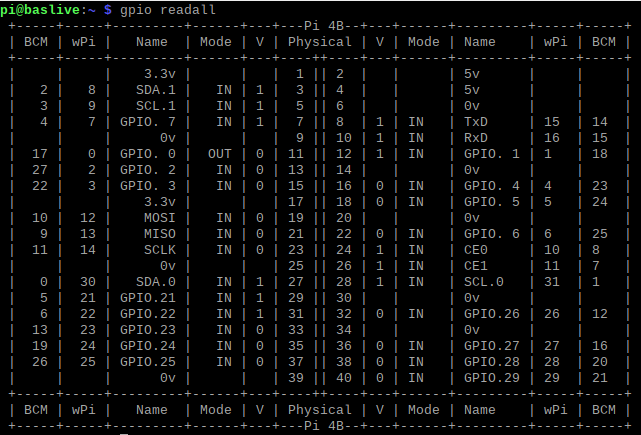

# Introduction

Here a collection of Information for future reference.

## Modules purchased for the starter kit

> For RPi 4 Model B - with 64GB SD and 4GB RAM
> https://www.amazon.de/gp/product/B07YYWZDX7/ref=ppx_yo_dt_b_asin_title_o03_s00?ie=UTF8&psc=1

> For RPi Camera Module:
> https://www.amazon.de/gp/product/B07TWHCSMT/ref=ppx_yo_dt_b_asin_title_o04_s00?ie=UTF8&psc=

## Commit to multiple repo

As this repo has multiple git remotes, I find it easier to using the below command to push the commits instantly to the multiple repos.

```bash
npm run push "commit message"
```

> _**NodeJs** must be installed._

## Contents

- I - Instructions
- P - Projects

| Type | Id  |    Date    | Link                                                                                  |
| :--: | :-: | :--------: | ------------------------------------------------------------------------------------- |
|  I   |  1  | 27.05.2020 | [Setup Raspberry Pi](/myInstructions/01_Setup_Raspberry_Pi.md)                        |
|  I   |  2  | 02.06.2020 | [Remote Desktop Setup](/myInstructions/02_Remote_Desktop_Setup.md)                    |
| ---  | --- | ---------- | ------------------------------------------------------------------------------------- |
|  P   |  1  | 28.05.2020 | [RPi Webcam Setup](/myProject/01_RPi_WebCam_Setup.md)                                 |
|  P   |  2  | 02.06.2020 | [Tensorflow object detection](/myProject/02_Tensorflow_Lite_Object_Detection.md)      |
|  P   |  3  | 19.06.2020 | [Freenove Projects](/myCode/Freenove/README.md)                                       |
| ---  | --- | ---------- | ------------------------------------------------------------------------------------- |

## Board definition


