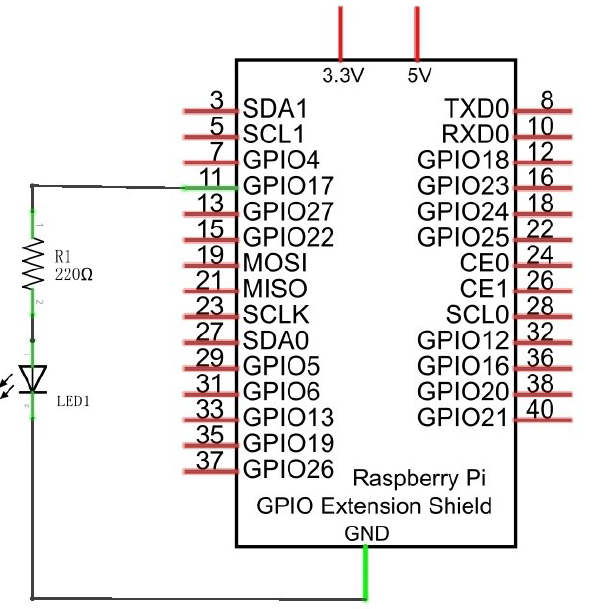
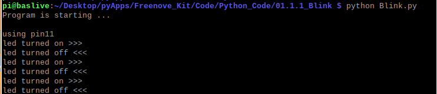
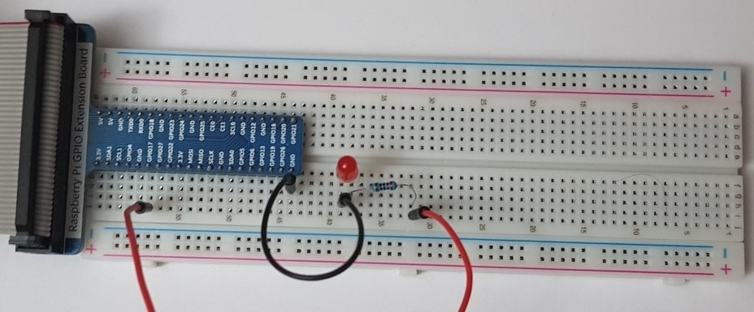
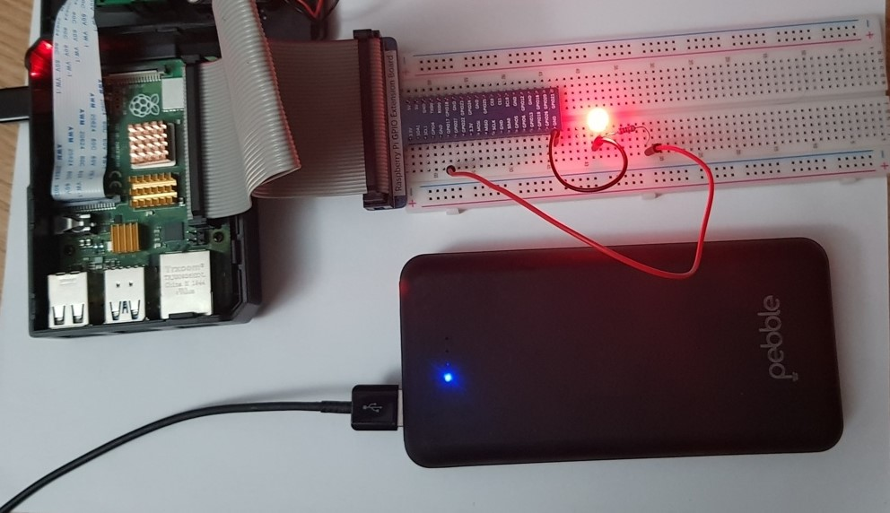
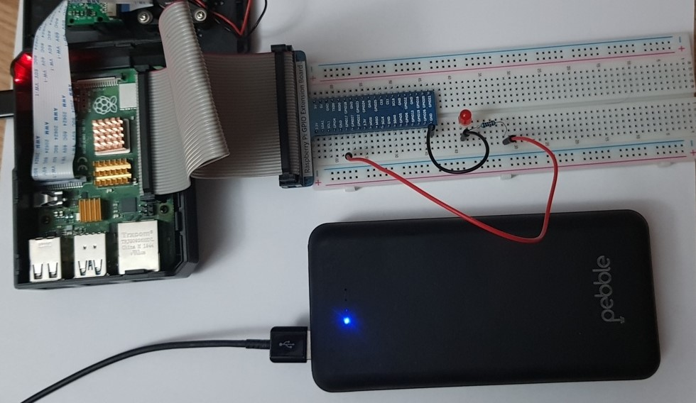

# 01. Blinking LED

> **_WARNING:_** Basic knowledge and working of different electronic components such as LEDs, Resistors is expected to proceed with these projects. I will try to explain the components and their working in this repo in the [Components](../00_Components/README.md) section. If you require assistance, just drop an issue.

## Componets required

- 1 x RPi 4B
- 1 x GPIO Extension Board & Wire
- 1 x Breadboard
- 1 x LED
- 1 x Resistor 220Ω
- 2 x Jumper

## Program code

```python
import RPi.GPIO as GPIO
import time

pinNo = 11

def setup():
    GPIO.setmode(GPIO.BOARD)
    GPIO.setup(pinNo, GPIO.OUT)
    GPIO.output(pinNo, GPIO.LOW)
    print("using pin: %d"%pinNo)

def loop():
    while True:
        GPIO.ouptut(pinNo, GPIO.HIGH)
        print("led ON")
        time.sleep(1)
        GPIO.ouptut(pinNo, GPIO.LOW)
        print("led OFF")
        time.sleep(1)

def destory():
    GPIO.cleanup()

if __name__ = "__main__":
    print("Program is starting ... \n")
    setup()
    try:
        loop()
    except KeyboardInterrupt:
        destro()

```

## Execution

RPi can also be powered with Powerbank.

> **Recommended Output for Powerbank**
>
> `DC out 5V` <br> 
> `I 2.5A`

### Circuit diagram



### Practical

| Step                          | Screenshot                           |
| ----------------------------- | ------------------------------------ |
| Program execution             |           |
| Complete ciruction connection |  |
| Led ON                        |              |
| Led OFF                       |             |
| Working                       |             |