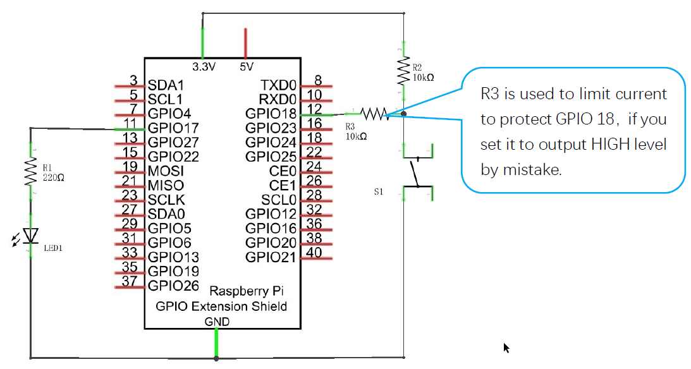
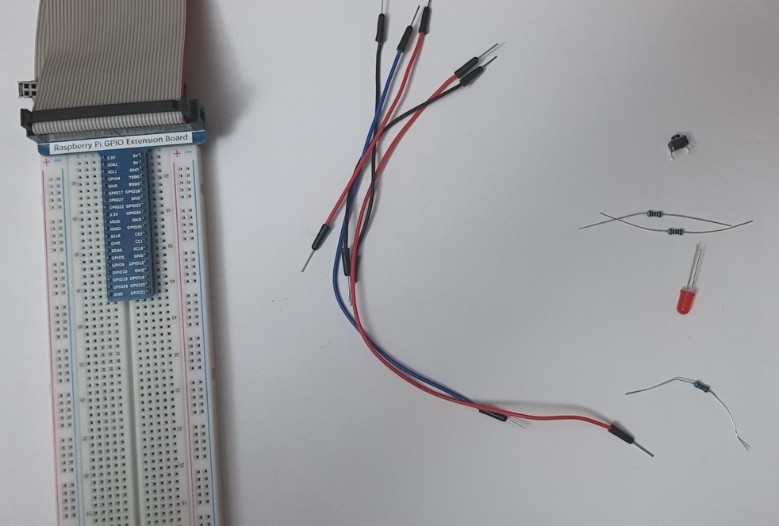
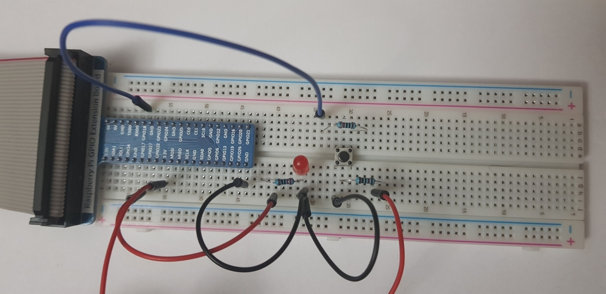

# 02. Button and LED

> **_WARNING:_** Basic knowledge and working of different electronic components such as LEDs, Resistors is expected to proceed with these projects. I will try to explain the components and their working in this repo in the [Components](../00_Components/README.md) section. If you require assistance, just drop an issue.

## Goal

To switch on/off LED using a push-button.

## Componets required

- 1 x RPi 4B
- 1 x GPIO Extension Board & Wire
- 1 x Breadboard
- 1 x LED
- 1 x Resistor 220Ω
- 2 x Resistor 10kΩ
- 5 x Jumper

## Program code

```python
import RPi.GPIO as GPIO

ledPin = 11
buttonPin = 12


def setup():
    GPIO.setmode(GPIO.BOARD)
    GPIO.setup(ledPin, GPIO.OUT)
    GPIO.setup(buttonPin, GPIO.IN, pull_up_down=GPIO.PUD_UP)
    print('using led pin at: %d'%ledPin)
    print('using button pin at: %d'%buttonPin)

def loop():
    while True:
        if GPIO.input(buttonPin)==GPIO.LOW: # button is pressed
            GPIO.output(ledPin,GPIO.HIGH)
            print ('led ON')
        else :
            GPIO.output(ledPin,GPIO.LOW)
            print ('led OFF')

def destory():
    GPIO.cleanup()

if __name__ == '__main__':
    print('Program is starting ... \n')
    setup()
    try:
        loop()
    except KeyboardInterrupt:
        destroy()

```

### Circuit diagram

</img>

### Practical

| Step                       | Screenshot                           |
| -------------------------- | ------------------------------------ |
| Components                 |          |
| Complete ciruct connection |  |
| Working                    |             |
