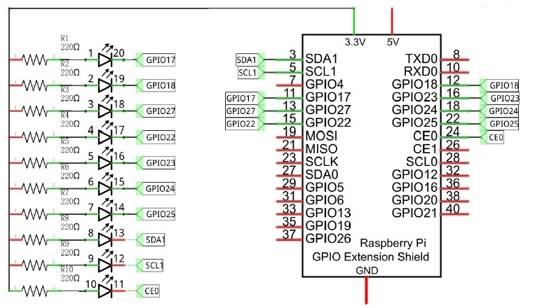
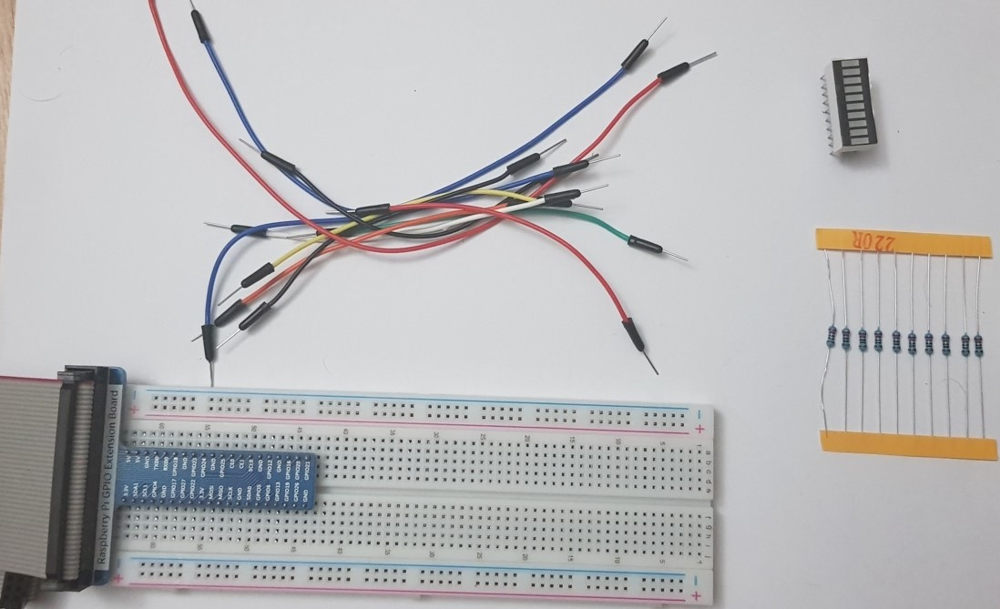
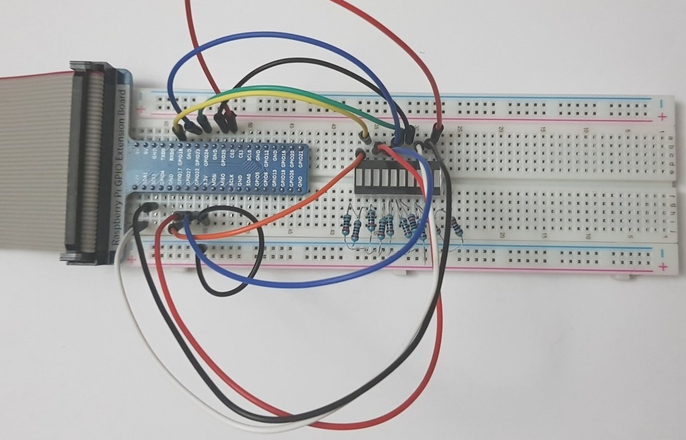
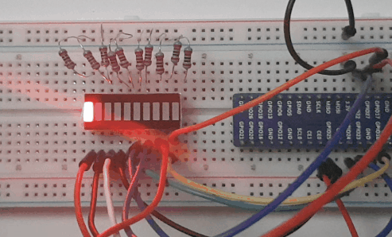

# 03. LED Graph

> **_WARNING:_** Basic knowledge and working of different electronic components such as LEDs, Resistors is expected to proceed with these projects. I will try to explain the components and their working in this repo in the [Components](../00_Components/README.md) section. If you require assistance, just drop an issue.

## Goal

To use LED bar graph component to simulate water flow.

## Componets required

- 1 x RPi 4B
- 1 x GPIO Extension Board & Wire
- 1 x Breadboard
- 1 x LED bar graph
- 10 x Resistor 220Ω
- 11 x Jumper

## Program code

```python
import time
import RPi.GPIO as GPIO

ledPins = [11, 12, 13, 15, 16, 18, 22, 3, 5, 24]

def setup():
    GPIO.setmode(GPIO.BOARD)
    GPIO.setup(ledPins, GPIO.OUT)
    GPIO.output(ledPins, GPIO.HIGH)

def loop():
    while True:
        for pin in ledPins:
            GPIO.output(pin, GPIO.LOW)
            print('pin OFF: %d'%pin)
            time.sleep(0.1)
            GPIO.output(pin, GPIO.HIGH)
            
        for pin in ledPins[::-1]:
            GPIO.output(pin, GPIO.LOW)
            time.sleep(0.1)
            GPIO.output(pin, GPIO.HIGH)
            print('pin ON: %d'%pin)
            
def destroy():
    GPIO.cleanup()
    
if __name__ == '__main__':
    print('Program is starting ... \n')
    setup()
    try:
        loop()
    except KeyboardInterrupt:
        destroy()

```

### Circuit diagram

</img>

### Practical

| Step                       | Screenshot                           |
| -------------------------- | ------------------------------------ |
| Components                 |          |
| Complete ciruct connection |  |
| Working                    |             |
