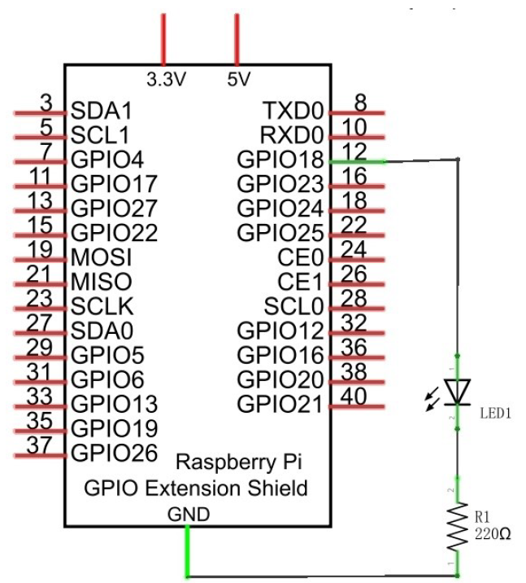
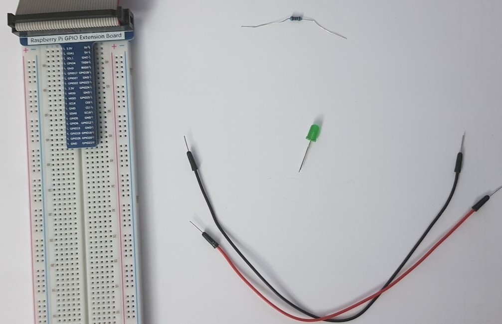
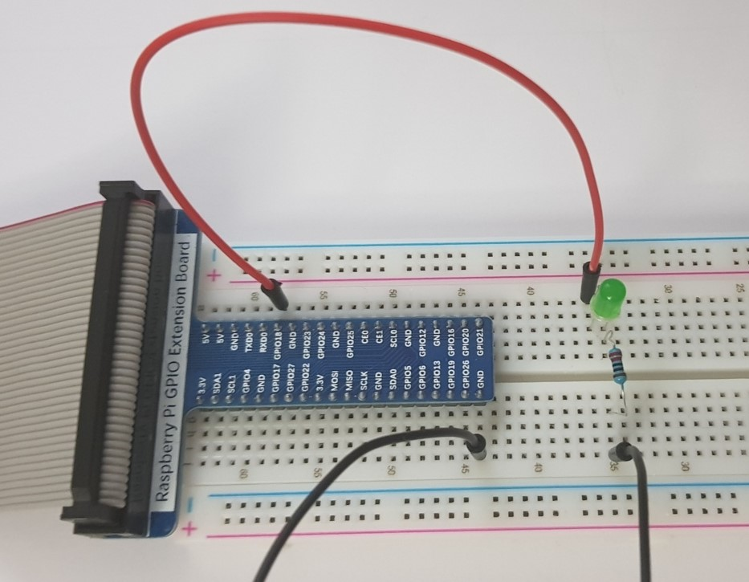
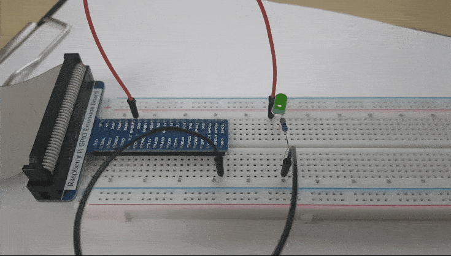

# 04. Breathing LED

> **_WARNING:_** Basic knowledge and working of different electronic components such as LEDs, Resistors is expected to proceed with these projects. I will try to explain the components and their working in this repo in the [Components](../00_Components/README.md) section. If you require assistance, just drop an issue.

## Goal

To use Pulse-Width-Modulation PWM technique to turn on LED from 0 to 100%.

## Componets required

- 1 x RPi 4B
- 1 x GPIO Extension Board & Wire
- 1 x Breadboard
- 1 x LED
- 1 x Resistor 220Ω
- 2 x Jumper

## Program code

```python
import time
import RPi.GPIO as GPIO

ledPin = 12

def setup():
    global p
    # GPIO.setwarnings(False) # to disable warnings like channel already in use
    GPIO.setmode(GPIO.BOARD)
    GPIO.setup(ledPin, GPIO.OUT)
    GPIO.output(ledPin, GPIO.LOW)

    p = GPIO.PWM(ledPin, 500) # set PWM with 500Hz
    p.start(0)

def loop():
    while True:
        for dc in range(0, 101, 1):
            p.ChangeDutyCycle(dc)
            time.sleep(0.01)
        time.sleep(1)
        for dc in range(100, -1, -1):
            p.ChangeDutyCycle(dc)
            time.sleep(0.01)
        time.sleep(1)

def destroy():
    p.stop()
    GPIO.cleanup()

if __name__ == '__main__':
    print('Program is starting ... \n')
    setup()
    try:
        loop()
    except KeyboardInterrupt:
        destroy()

```

### Circuit diagram

</img>

### Practical

| Step                       | Screenshot                           |
| -------------------------- | ------------------------------------ |
| Components                 |          |
| Complete ciruct connection |  |
| Working                    |             |
