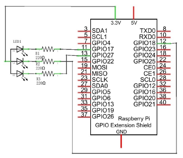
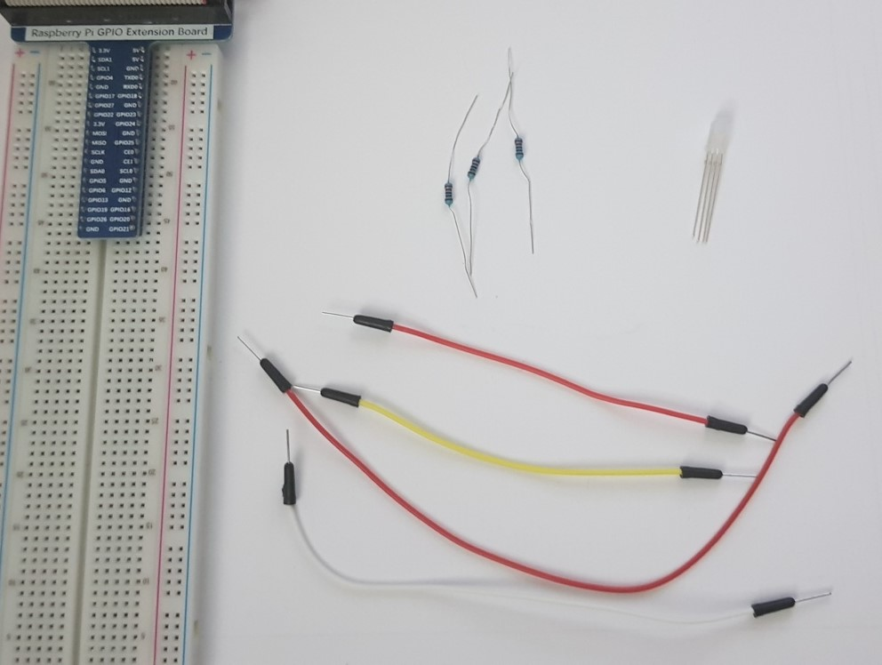
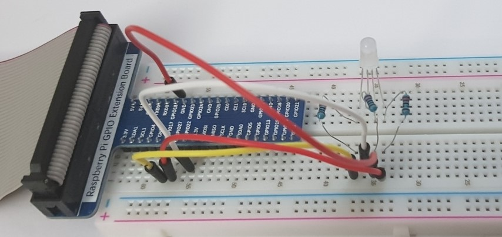
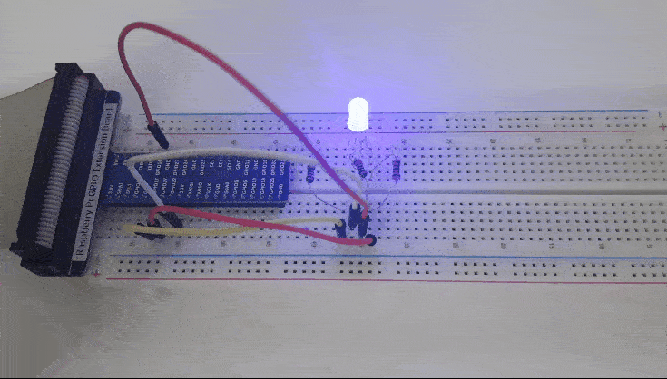

# 05. Colorful LED

> **_WARNING:_** Basic knowledge and working of different electronic components such as LEDs, Resistors is expected to proceed with these projects. I will try to explain the components and their working in this repo in the [Components](../00_Components/README.md) section. If you require assistance, just drop an issue.

## Goal

To generate different colors using RGB LED.

## Componets required

- 1 x RPi 4B
- 1 x GPIO Extension Board & Wire
- 1 x Breadboard
- 1 x RGB LED
- 3 x Resistor 220Ω
- 4 x Jumper

## Program code

```python
import RPi.GPIO as GPIO
import time
import random
pins = [11,12,13]

def setup():
    global pwmRed,pwmGreen,pwmBlue

    GPIO.setmode(GPIO.BOARD)
    GPIO.setup(pins, GPIO.OUT)
    GPIO.output(pins, GPIO.HIGH)

    pwmRed = GPIO.PWM(pins[0], 2000) # set PWM Frequence to 2kHz
    pwmGreen = GPIO.PWM(pins[1], 2000)
    pwmBlue = GPIO.PWM(pins[2], 2000)

    pwmRed.start(0)
    pwmGreen.start(0)
    pwmBlue.start(0)

def setColor(r_val, g_val, b_val):
    pwmRed.ChangeDutyCycle(r_val)
    pwmGreen.ChangeDutyCycle(g_val)
    pwmBlue.ChangeDutyCycle(b_val)

def loop():
    while True:
        r=random.randint(0,100)
        g=random.randint(0,100)
        b=random.randint(0,100)

        setColor(r,g,b)
        print('r=%d, g=%d, b=%d' %(r,g,b))
        time.sleep(0.3)

def destroy():
    pwmRed.stop()
    pwmGreen.stop()
    pwmBlue.stop()
    GPIO.cleanup()

if __name__ == '__main__':
    print('Program is starting ... \n')
    setup()
    try:
        loop()
    except KeyboardInterrupt:
        destroy()

```

### Circuit diagram

</img>

### Practical

| Step                       | Screenshot                           |
| -------------------------- | ------------------------------------ |
| Components                 |          |
| Complete ciruct connection |  |
| Working                    |             |
