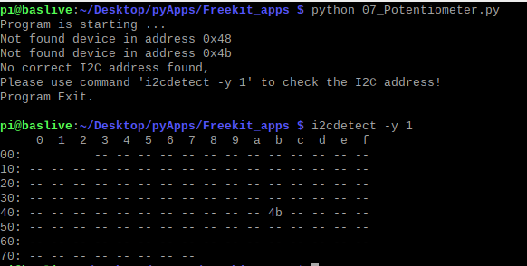
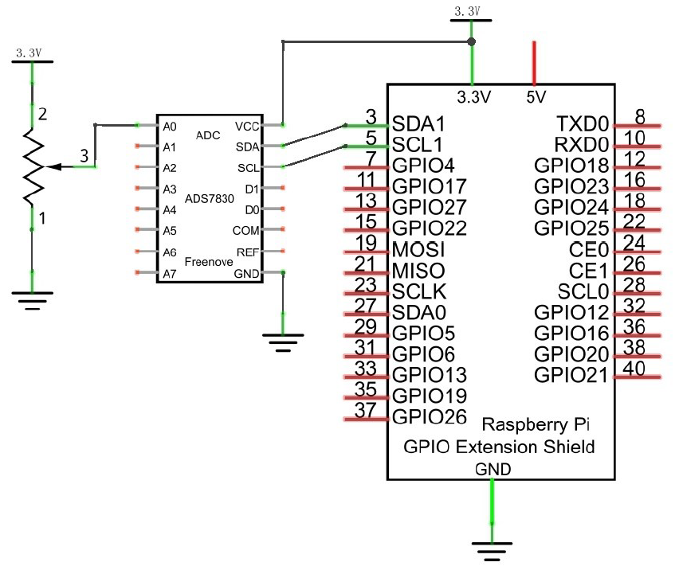
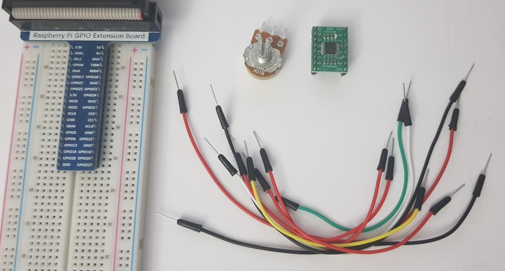
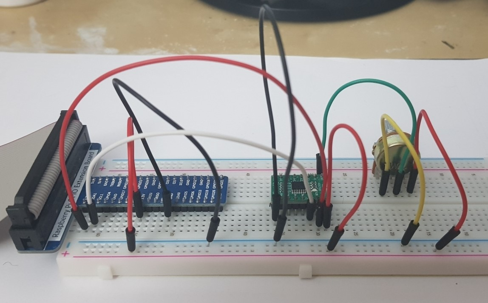

# 07. Potentiometer

> **_WARNING:_** Basic knowledge and working of different electronic components such as LEDs, Resistors is expected to proceed with these projects. I will try to explain the components and their working in this repo in the [Components](../00_Components/README.md) section. If you require assistance, just drop an issue.

## Goal

In this project, we will use the ADC function of ADC Module to read the voltage value of potentiometer.

## Componets required

- 1 x RPi 4B
- 1 x GPIO Extension Board & Wire
- 1 x Breadboard
- 1 x Potentiometer
- 1 x ADC Module (ADS7830)
- 9 x Jumper

## Pre-requistes

1. Activate i2c interface

   ```sh
    sudo raspi-config

    # choose “5 Interfacing Options” --> “P5 I2C” --> “Yes” --> “Finish” in order and restart your RPi
   ```

2. Confirm whether i2c is activated

   ```sh
   lsmod | grep i2c
   ```

3. Install i2c tools and smbus

   ```sh
   sudo apt-get install i2c-tools

   i2cdetect -y 1

   # for ADC S7830, `4b` must be shown.
   ```

   > **NOTE:** If the GPIO connector is not connected properly, then the i2c is not detected. 

4. Install the driver from `lib` folder

   ```sh
   tar zxvf ADCDevice-1.0.3.tar.gz

   cd ADCDevice-1.0.3

   sudo python3 setup.py install
   ```

## Program code

```python
import time
from ADCDevice import *

adc = ADCDevice() # Define an ADCDevice class object

def setup():
    global adc
    if(adc.detectI2C(0x48)): # Detect the pcf8591.
        adc = PCF8591()
    elif(adc.detectI2C(0x4b)): # Detect the ads7830
        adc = ADS7830()
    else:
        print("No correct I2C address found, \n"
        "Please use command 'i2cdetect -y 1' to check the I2C address! \n"
        "Program Exit. \n")
        exit(-1)

def loop():
    while True:
        value = adc.analogRead(0)    # read the ADC value of channel 0
        voltage = value / 255.0 * 3.3  # calculate the voltage value
        print ('ADC Value : %d, Voltage : %.2f'%(value,voltage))
        time.sleep(0.1)

def destroy():
    adc.close()

if __name__ == '__main__':   # Program entrance
    print ('Program is starting ... ')
    try:
        setup()
        loop()
    except KeyboardInterrupt: # Press ctrl-c to end the program.
        destroy()

```

### Circuit diagram

</img>

### Practical

| Step                       | Screenshot                           |
| -------------------------- | ------------------------------------ |
| Components                 |          |
| Complete ciruct connection |  |
| Working                    |             |
