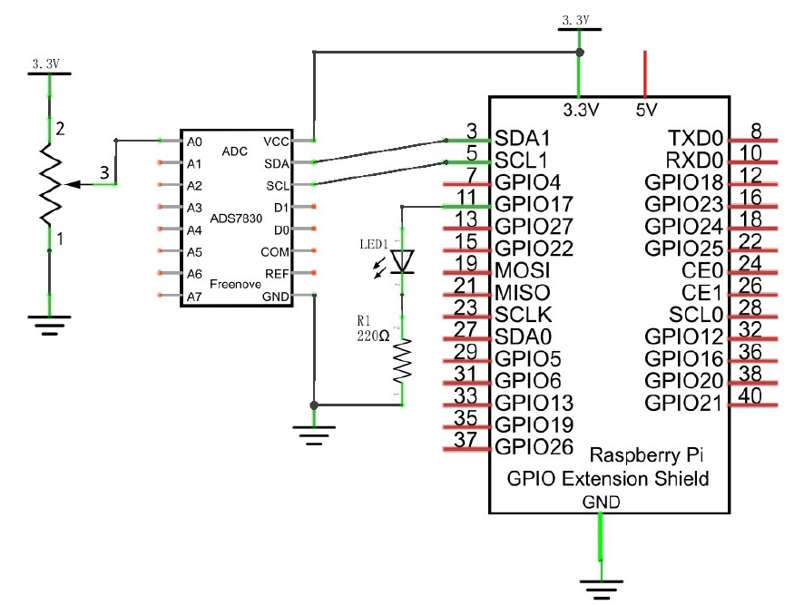
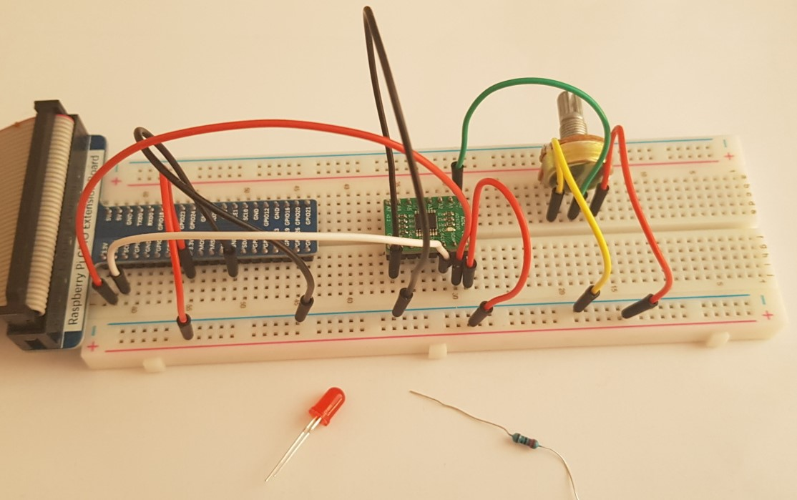

# 08. Soft light

> **_WARNING:_** Basic knowledge and working of different electronic components such as LEDs, Resistors is expected to proceed with these projects. I will try to explain the components and their working in this repo in the [Components](../00_Components/README.md) section. If you require assistance, just drop an issue.

## Goal

In this project, we will make a soft light. Use ADC Module to read ADC value of potentiometers and map it to duty cycle ratio of PWM used to control the brightness of LED. Then you can make the LED brightness changed by adjusting the potentiometer.

## Componets required

- 1 x RPi 4B
- 1 x GPIO Extension Board & Wire
- 1 x Breadboard
- 1 x Potentiometer
- 1 x ADC Module (ADS7830)
- 1 x LED
- 1 x Resistor 220Ω
- 11 x Jumper

## Pre-requisites

This project is built on top of Project-7. Make sure the setup procedures for ADC module is performed, before proceeding further.

## Program code

```python
import time
from ADCDevice import *
import RPi.GPIO as GPIO

ledPin = 11
adc = ADCDevice() # Define an ADCDevice class object

def setup():
    global adc
    if(adc.detectI2C(0x48)): # Detect the pcf8591.
        adc = PCF8591()
    elif(adc.detectI2C(0x4b)): # Detect the ads7830
        adc = ADS7830()
    else:
        print("No correct I2C address found, \n"
        "Please use command 'i2cdetect -y 1' to check the I2C address! \n"
        "Program Exit. \n")
        exit(-1)
    global p
    GPIO.setmode(GPIO.BOARD)
    GPIO.setup(ledPin, GPIO.OUT)
    p = GPIO.PWM(ledPin, 1000)
    p.start(0)

def loop():
    while True:
        value = adc.analogRead(0)    # read the ADC value of channel 0
        p.ChangeDutyCycle(value*100/255)
        voltage = value / 255.0 * 3.3  # calculate the voltage value
        print ('ADC Value : %d, Voltage : %.2f'%(value,voltage))
        time.sleep(0.03)

def destroy():
    adc.close()
    GPIO.cleanup()

if __name__ == '__main__':   # Program entrance
    print ('Program is starting ... ')
    try:
        setup()
        loop()
    except KeyboardInterrupt: # Press ctrl-c to end the program.
        destroy()

```

### Circuit diagram

</img>

### Practical

| Step                       | Screenshot                           |
| -------------------------- | ------------------------------------ |
| Components                 |          |
| Complete ciruct connection |  |
| Working                    |             |
