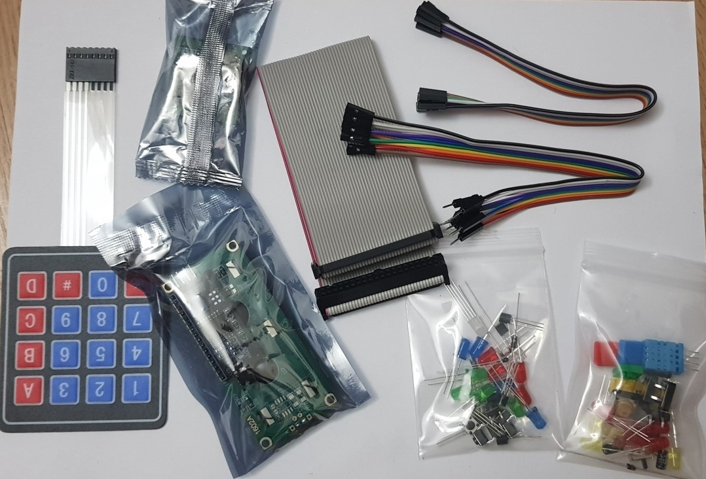
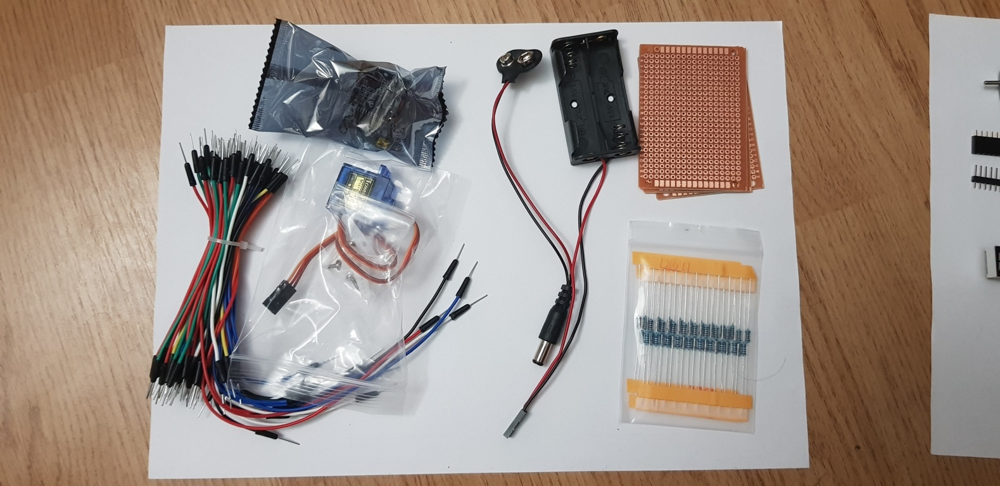
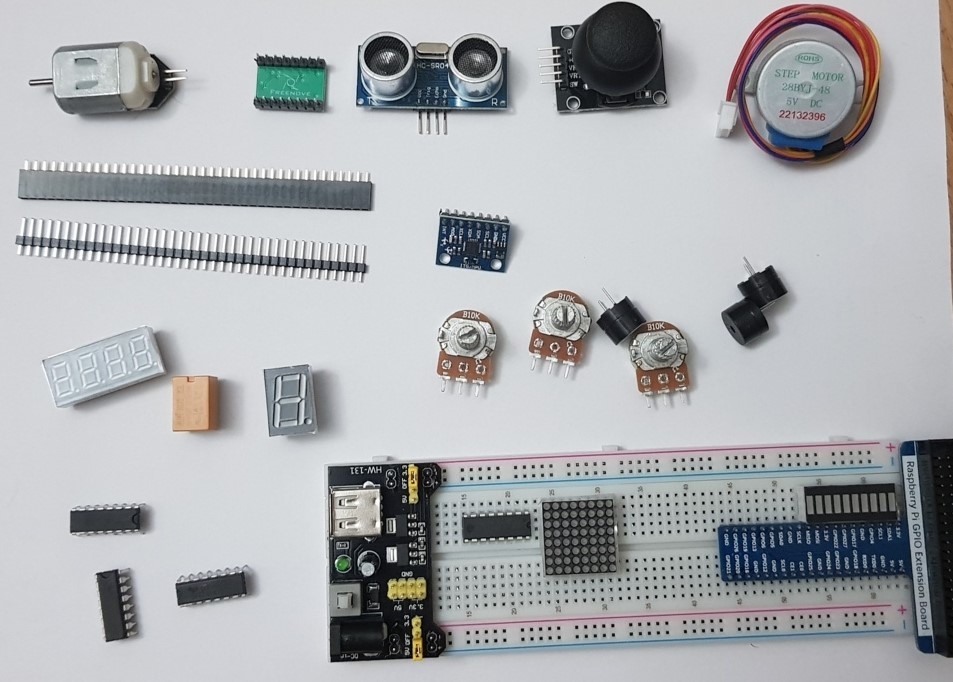

# Freenove Projects

 
 
 
<strong>About Freenove</strong>

Freenove is an open-source electronics platform.

Freenove is committed to helping customer quickly realize the creative idea and product prototypes, making it easy to get started for enthusiasts of programing and electronics and launching innovative open source products.

The services include:

- Robot kits
- Learning kits for Arduino, Raspberry Pi and micro:bit
- Electronic components and modules, tools
- Product customization service

The code and circuit are open source. You can obtain the details and the latest information through visiting the following web site: http://www.freenove.com

They are set of projects that comes along with the Freenove starter kit.

They offer tutorials for following programming languages

- C
- Python
- Java

In this repo, we will look into Python coding. The original tutorials can be found in: https://github.com/Freenove/Freenove_Ultimate_Starter_Kit_for_Raspberry_Pi

> **_WARNING:_** Basic knowledge and working of different electronic components such as LEDs, Resistors is expected to proceed with these projects. I will try to explain the components and their working in this repo in the [Components](./00_Components/README.md) section. If you require assistance, just drop an issue.

## Kit purchased for this exercise

> `Link to the kit` https://www.amazon.de/gp/product/B06W54L7B5/ref=ppx_yo_dt_b_asin_title_o00_s00?ie=UTF8&psc=1

### Components

## Dataflow

## Overview of the projects performed

| ID  |    Date    | Project                                         |
| :-: | :--------: | ----------------------------------------------- |
|  1  | 21.06.2020 | [Blinking LED](./01_Blinking_LED/README.md)     |
|  2  | 23.06.2020 | [Button and LED](./02_Button_and_LED/README.md) |
|  3  | 24.06.2020 | [LED Graph](./03_LED_Graph/README.md)           |
