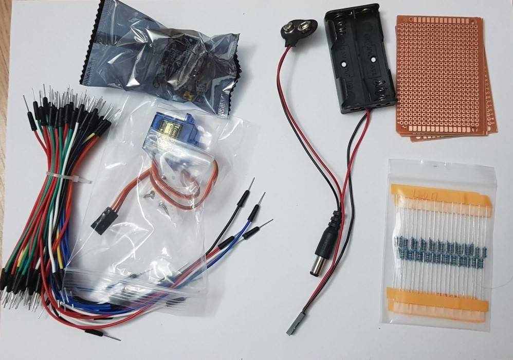

# Freenove Projects

 <details> 
 <summary><strong>About Freenove</strong>
</summary>
Freenove is an open-source electronics platform.

Freenove is committed to helping customer quickly realize the creative idea and product prototypes, making it easy to get started for enthusiasts of programing and electronics and launching innovative open source products.

The services include:

- Robot kits
- Learning kits for Arduino, Raspberry Pi and micro:bit
- Electronic components and modules, tools
- Product customization service

The code and circuit are open source. You can obtain the details and the latest information through visiting the following web site: http://www.freenove.com</details>

They are set of projects that comes along with the Freenove starter kit.

They offer tutorials for following programming languages

- C
- Python
- Java

In this repo, we will look into Python coding. The original tutorials can be found in: https://github.com/Freenove/Freenove_Ultimate_Starter_Kit_for_Raspberry_Pi

> **_WARNING:_** Basic knowledge and working of different electronic components such as LEDs, Resistors is expected to proceed with these projects. I will try to explain the components and their working in this repo in the [Components](./00_Components/README.md) section. If you require assistance, just drop an issue.

## Kit purchased for this exercise

> `Link to the kit` https://www.amazon.de/gp/product/B06W54L7B5/ref=ppx_yo_dt_b_asin_title_o00_s00?ie=UTF8&psc=1

### Freenove Starter Kit Installation

1. Normally, WiringPI is pre-installed in the newer versions of RPi. If not follow the below steps.

   ```bash
   sudo apt-get update
   sudo apt-get upgrade
   sudo apt-get install wiringpi
   gpio -v # to check the installed version
   ```

2. If you want to use editor Geany or Thonny, you need set Python3 as default Python first, please follow
   the steps below.

   - Enter directory /usr/bin <br>
     `cd /usr/bin`
   - Delete the old python link. <br>
     `sudo rm python`
   - Creat new python links to python3. <br>
     `sudo ln -s python3 python`
   - Execute python to check whether the link succeeds. <br>
     `python`

3. If you are using Raspberry Pi 4B, there will be errors when executing command “gpio readall”. As is below:

   This is because the official version of the library supporting 4B has not yet been released, which result in some commands can not be used properly. But it won't affect the next project. For this problem, you can solve it by installing a patch. Just execute the commands below in the terminal.

   ```bash
   sudo wget https://project-downloads.drogon.net/wiringpi-latest.deb
   sudo dpkg -i wiringpi-latest.deb
   gpio readall
   ```

### Components





## Dataflow


## Overview of the projects performed

| ID  |    Date    | Project                                         |
| :-: | :--------: | ----------------------------------------------- |
|  1  | 21.06.2020 | [Blinking LED](./01_Blinking_LED/README.md)     |
|  2  | 23.06.2020 | [Button and LED](./02_Button_and_LED/README.md) |
|  3  | 24.06.2020 | [LED Graph](./03_LED_Graph/README.md)           |
|  4  | 24.06.2020 | [Breathing LED](./04_Breathing_LED/README.md)   |
|  5  | 29.06.2020 | [Colorful LED](./05_Colorful_LED/README.md)     |
